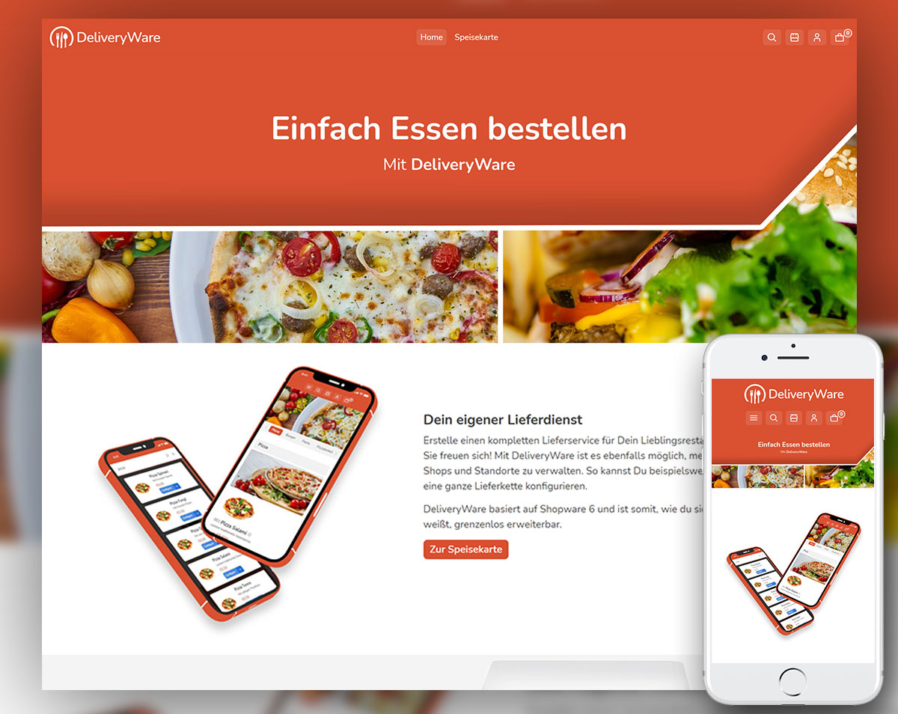
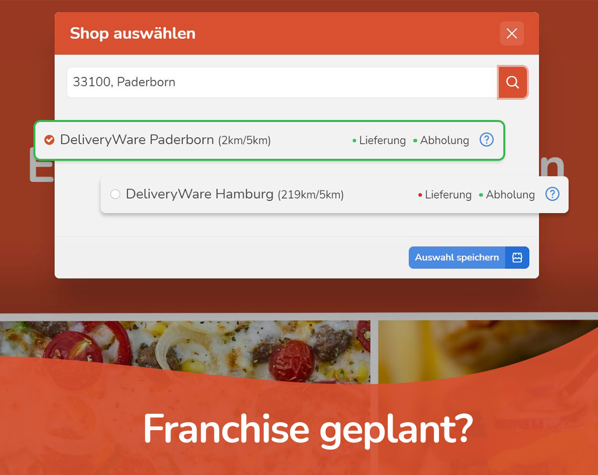
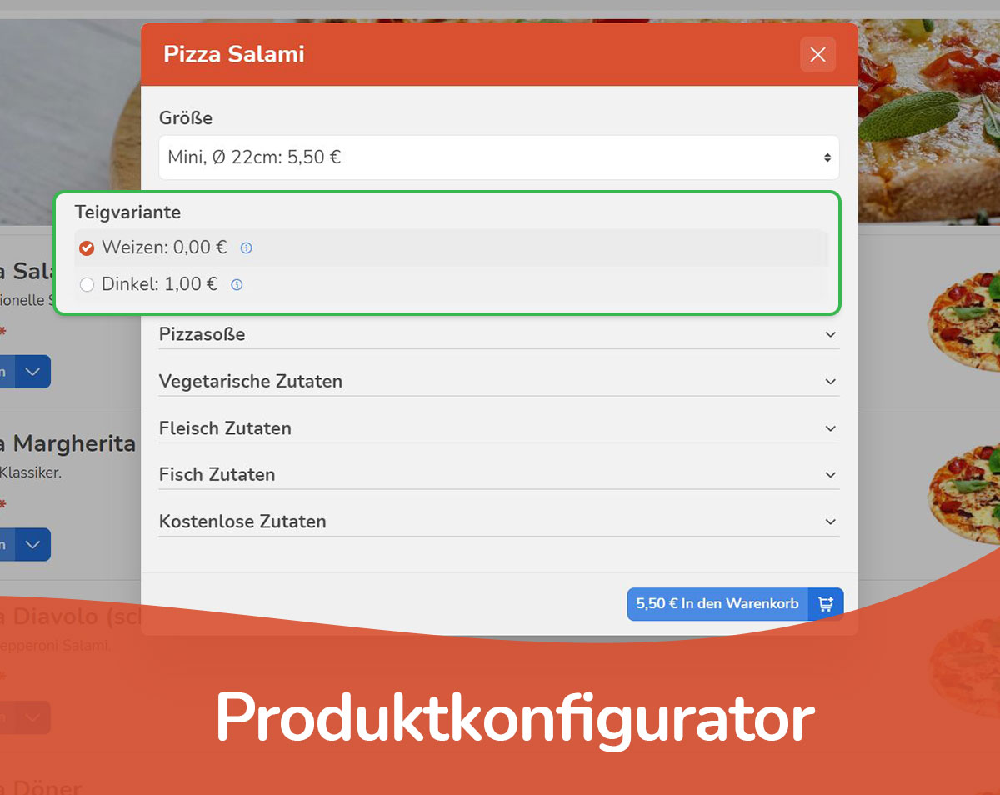

## Teaser Text
### DE
DeliveryWare ist eine All-In-One Lösung für Deinen Online-Lieferdienst. Nützliche Funktionen unterstützen Dich für den optimalen Workflow bei der Abwicklung Deiner Bestellungen.

### EN
DeliveryWare is an all-in-one solution for your online food delivery service. Useful functions support you for the optimal workflow when processing your orders.

## Beschreibung

Keine Lust auf veraltete Software Lösungen und ohne jegliche Reichweite? Gar kein Bock mehr auf Orange? Hier gibt es nicht nur eine Alternative - wir sind besser!

Mit DeliveryWare bekommst Du für Dein Shopware 6 System ein Theme, eine App und nützliche Schnittstellen um deinen Kunden ein optimales Einkaufserlebnis zu gewährleisten.

Die All-In-One Lösung beinhaltet eine für Dein Business optimierte Bestellverwaltung (Dashboard). Mit den DeliveryWare Demo Paketen hast du auf Anhieb passende Inhalte und Produkte - abgestimmt auf Dein Angebot.

## Highlights & Features

Folgende Funktionen sind bereits in unserer App enthalten und werden in kommenden Updates verbessert:

- Vollständig Kompatibel mit der aktuellsten Shopware 6 Version
- Optimierte Frontend-Darstellung der "Speisekarte" - Deine Kunden können ihr Lieblingsessen einfach und schnell Konfigurieren und in den Warenkorb legen
- Multi-Store-Funktion: Du kannst mehrere Standorte verwalten, jeder Standort für sich hat einen eigenen Auslieferungs-Radius, eigene Öffnungszeiten und eigene Angebote
- Store-Auswahl: Deine Kunden können sich den Store bei ihrer Bestellung aussuchen
- Wunschlieferzeit/Wunschabholzeit: Können von Dir frei und individuell Konfiguriert werden
- Ausschließung von Angeboten aus Bestimmten Stores möglich
- Lagerbestand in freien Intervallen auffüllbar: Gewisse Lebensmittel gibt es täglich nur in begrenzter Menge - z.B. Hühnereier
- Produktkonfigurator ohne Varianten - Schnell eingerichtet und auf der gesamten Kategorie Anwendebar - z.B. Pizza in 4 Größen und zusätzliche Zutaten
- Konfigurieren von "Bagdes": Verwende deinen eigenen SVGs und hebe Produkte hervor - z.B. Peperoni/Scharf, Blatt/Vegan usw - Lasse deine Kunden in deinem Shop nach den Badges filtern
- Konfigurieren von Inhaltsstoffen: Allgemiene Infos für Allergiker
- Konforme Preis-pro-Brechnung: Zeige deinen Kunden bei der Konfiguration der Gerichte immer einen Referenzpreis an - z.B. Brot: 750g, 6,67€ pro 1Kg
- Verbesserte Suche: Wir haben die Shopware Suche Grunderneuert
- Login/Registrierung: Wurde auf die wesentlich relevanten Infos verringert - Der Login-Flow wurde ebenfalls optimiert
- Automatische Validierung nach Öffnungszeiten und Umkreis: Deine Kunden können nur in einem bestimmten Umkreis und zu einer bestimmten Uhrzeit bestellen
- Zubereitungszeit/Lieferzeit: Tragen für eine geschätze Ankunftszeit bei deinen Kunden bei
- Karte und Countdown bei der Bestellung: Zeige deinen Kunden wie lange die Zubereitung dauert und wie der Status der Bestellung ist
- Bon-Drucker Anbindung: Drucke deine Bestellungen direkt und einfach (ohne zusätzlich Software) auf einem netzwerkfähigen Bon-Drucker aus. Unsere App liefert eine Schnittstelle zu dem Star mC-Print2 Drucker.
- GPS Tracking: Zeige deinen Kunden bei Statuswechsel "Lieferung" wo sich der zuständige Lieferant aktuell befindet - erspare deinen hungrigen Kunden somit das schmächtige Warten hinter der Haustür, wenn zufällig jemand durch die Straße fährt
- Unendlich erweiterbar: Durch Drittanbieter-Apps kannst du deinen Shop nach Belieben optimieren und individualisieren, Deiner Kreativität sind keine Grenzen gesetzt

## Bilder

