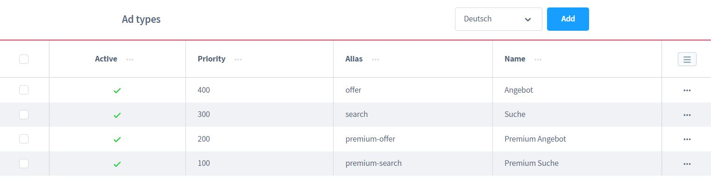

# Kleinanzeigen Preispläne

## Einleitung

Die Preispläne bieten dir und deinen Kunden interessante Möglichkeiten die 
Kleinanzeigen zu Präsentieren. Erstelle Pläne für Angebote, Gesuche und Premium
Features. Du bestimmst voll und ganz, was dein Kunde für die Veröffentlichung
einer Kleinanzeige zahlt. 

Ist die Nachfrage der Kleinanzeigen größer als das Angebot? 
Dann dreh den Spieß einfach um und lasse die Interessenten für eine
Kleinanzeige bei Kontaktaufnahme zahlen.

Dadurch hast du die volle Kontrolle und viele Möglichkeiten, 
dein Kleinanzeigen-Portal zu monetarisieren.

Das nächste interessante Feature sind die Boost-Optionen, so kannst du gegen ein
kleines Entgeld deinen Kunden mehr Sichtbarkeit anbieten. 
Die Kleinanzeigen erscheinen zum Beispiel auf der Startseite, 
im Kategorie-Listing immer ganz oben oder exklusiv auf jeder Content Seite.
Die Boost-Optionen werden immer pro 24h gebucht.

## Einstellungen

- Priorität: Bestimme hiermit die Anordnung deiner Preispläne
- Aktiv/Inaktiv
- Name des Preisplans
- Farbe: Hebe deine Preispläne farblich hervor
- Icon: Aktuell sind nur eine begrenzte Anzahl an Icons vorhanden - eine Übersicht erfolgt zu einem späteren Zeitraum
- Alias: Technischer Name des Preisplans
- Beschreibung
- Steuer: Falls du Kleinunternehmer bist, kannst du den Steuersatz selbst bestimmen
- Preise: _Achtung_ die automatische Berechnung Brutto/Netto funktioniert leider noch nicht, muss also manuell eingegeben werden
- Kundengruppen befreien: (Geplant) Biete z.B. deinen VIP Kunden gratis Optionen an - z.B. unbegrenzte Kontaktaufnahmen
