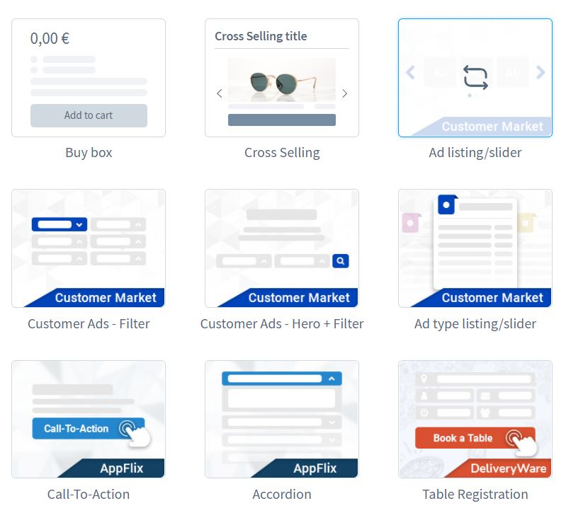
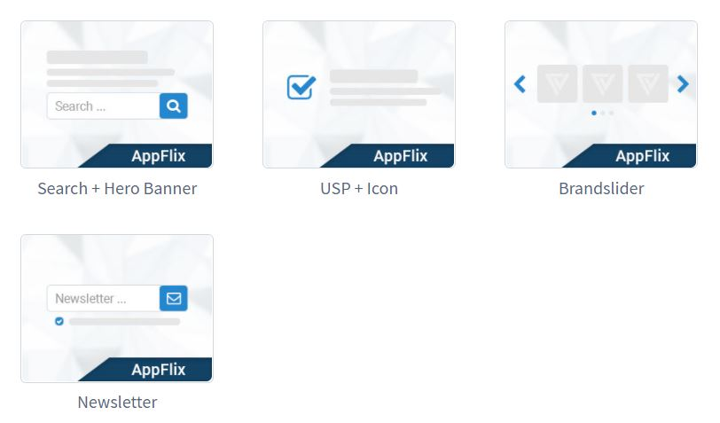
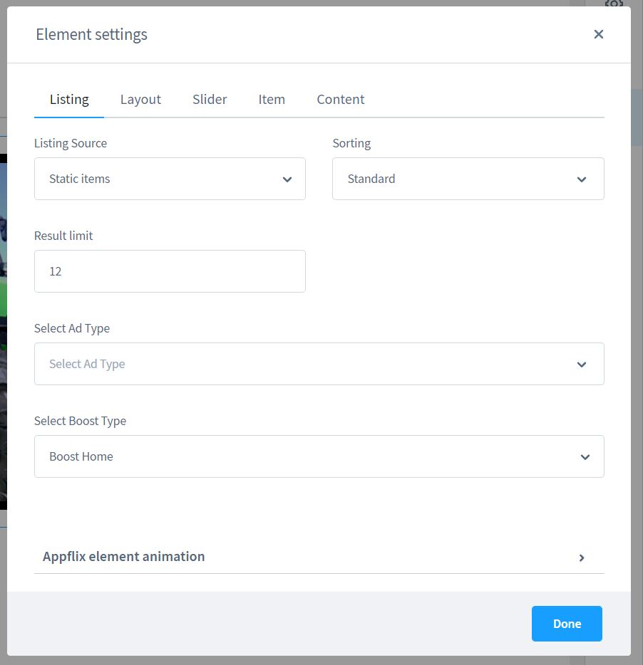
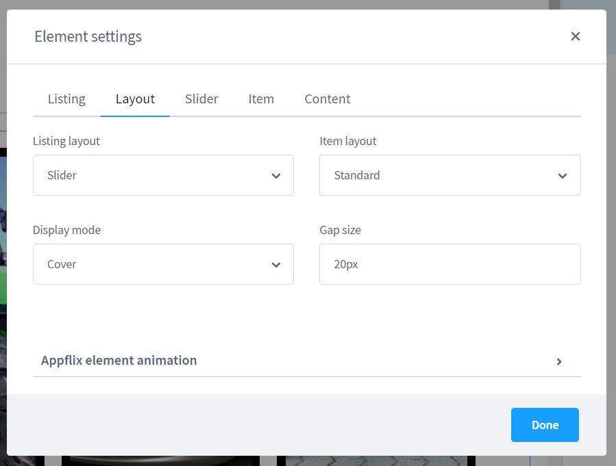
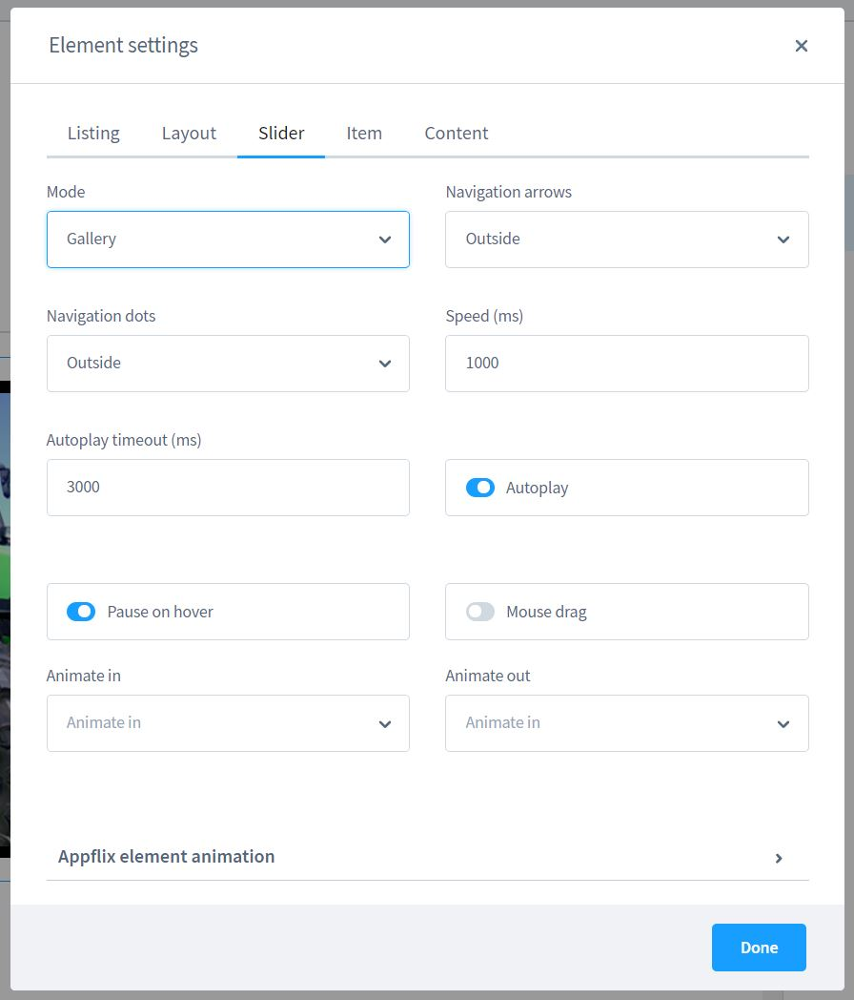
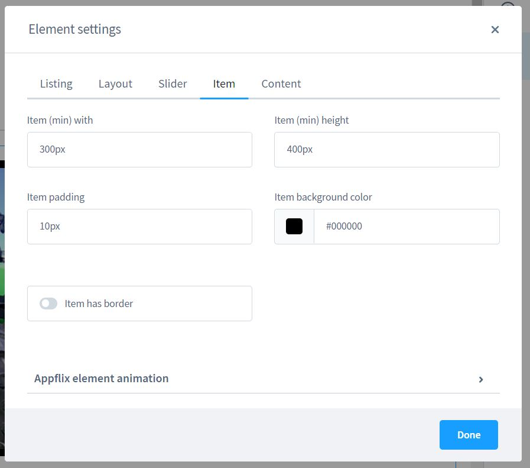
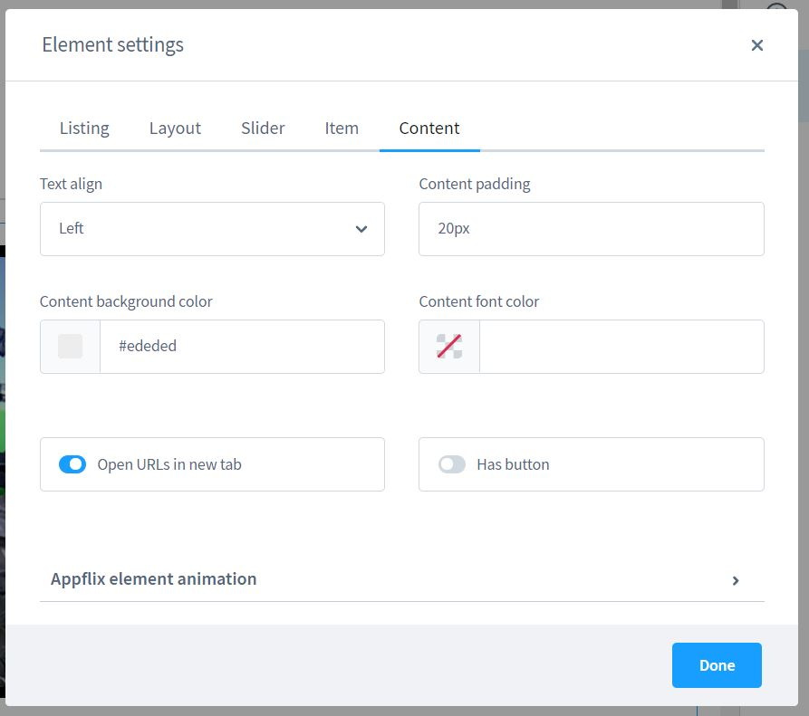

# Kleinanzeigen CMS Elemente

## Einleitung

Mit dieser Erweiterung erhälst du neben den nützlichrn Foundation Elementen
weitere exklusive CMS Elemente für Appflix Kleinanzeigen.

## Hero Banner mit Suchfunktion

Die Interessenten geben Ihren Ort ein und wonach sie suchen. Sie springen
direkt auf die Übersichtsseite mit passenden Ergebnissen. Wie es halt auf
Kleinanzeigen-Portalen üblich ist.

## Kleinanzeigen

Ein CMS Element, welches als dynamisches Listing mit Pagination dient, aber
auch als Slider genutzt werden kann. Hier entscheidest du, wo und wie 
zum Beispiel Kleinanzeigen mit exklusiven Boost-Optionen erscheinen.

Unser Demopaket beinhaltet genügend Beispiele für dich.

## Kleinanzeigen Preispläne

Dieses Element befindet sich bereits in unserem mitgeliferten Demopaket
auf der Startseite unten. Deine Kunden sehen transparent auf einem Blick
welche Möglichkeiten ihnen geboten werden.

Das Element kann als Slider mit unzähligen Einstellungsmöglichkeiten oder als
Grid/Raster dargestellt werden.
