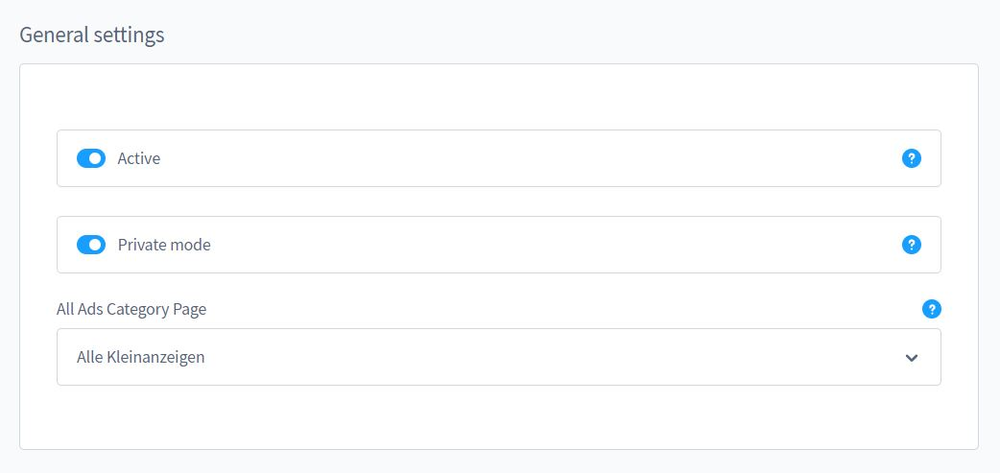
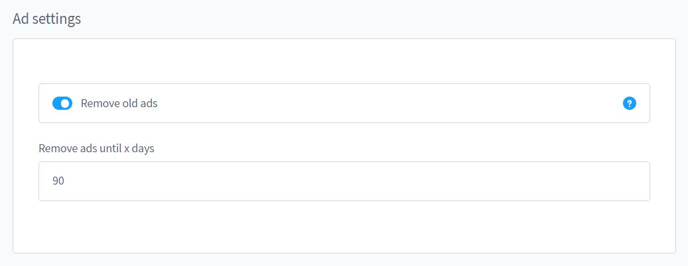
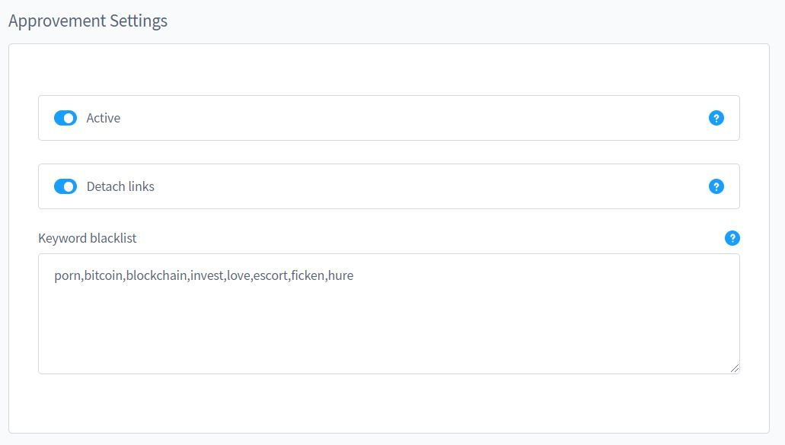

# Konfiguration

## Basis Einstellungen

- Aktiv/Inaktiv: Die Erweiterung kann für bestimmte Verkaufskanäle deaktiviert werden
- Privatmodus: Kontaktdaten der Kleinanzeigen sind erst nach Login einsehbar
- Einstiegspunkt für die Kleinanzeigen-Kategorie

## Kleinanzeigen Einstellung

- Alte Kleinanzeigen automatisch entfernen
- Anzeige nach X Tagen entfernen

## Freigabe Einstellungen

- Aktiv/Inaktiv: Der Freigabe Prozess kann automatisch oder manuell durchgeführt werden
- Links automatisch enternen: Zur Minimierung von Spam
- Schlüsselwörter sperren: Sollte eines dieser Wörter vorkommen, wird die Kleinanzeige abgelehnt
