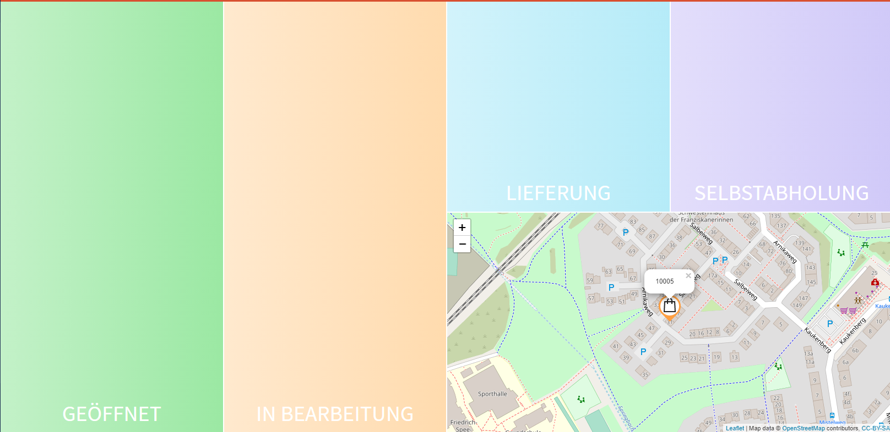

# Dashboard

For this documentation we use screenshots from the provided demo data for illustration.

The DeliveryWare dashboard can be found in the backend under Dashboard -> Shops. Dashboard von DeliveryWare ist im Backend unter Dashboard -> Shops zu finden.

## Overview from the dashboard

The dashboard can be divided into five sections.

So that the customer always knows which status his order has at the moment, he will be informed
will be informed about every change of status in the order confirmation and by e-mail.

### **Open orders:** 

Orders received are listed here.
Basic information such as address, payment method, delivery or self-collection
self-collection, telephone number and distance to the customer are displayed immediately.

Clicking on the order number opens the detailed view of the order.
Here you can see what the order contains from the customer.
The map is also focused on the delivery destination.

If an order should not be accepted, this can be rejected by click on
"CANCEL" you can also reject it.
Otherwise you have to confirm the order to continue the process.

### **In progress:**

If you have confirmed the order and set up a receipt printer, a message appears.
message appears, whether a receipt should be printed.

The order now has the status "In process". The customer is informed in the order confirmation
and can see that the status has changed.

To continue the process, it is now necessary to click on "COLLECTION" or "Delivery".
The button recognizes which option is available based on the selection made by the customer.

If the customer has selected "Delivery", a message appears in which a delivery service must be selected.
must be selected.

### **Delivery:**

This is the last status of an order.

By placing the order in this tile, the customer is informed that the order has been
has been processed and is in delivery.

If GPS tracking has been set up, the customer also has the option of
track the delivery / the supplier live.

If the delivery is completed and the order is paid, the order can be
can now be completed.

### **Self collection:**

This is the last status of an order.

By placing the order in this tile, the customer is informed that the order has been
has been processed so far that it is ready for collection.

Now the order can be completed.

### **Map:**

The map serves as a tool for planning a route for delivery, among other things.
can be planned.

By default, the focus is always in the center of all orders.
If an order is focused, the map also focuses on the corresponding address.

