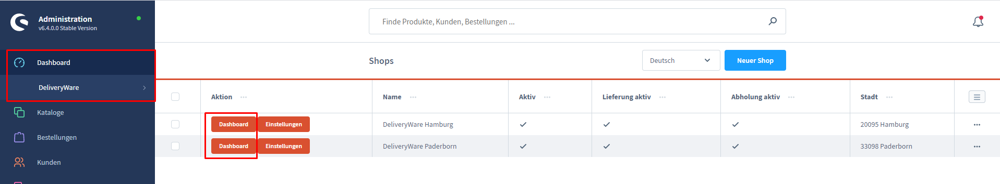
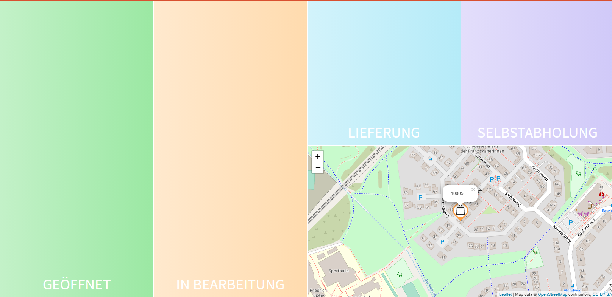
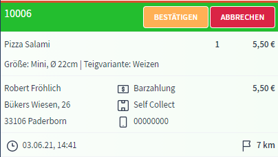
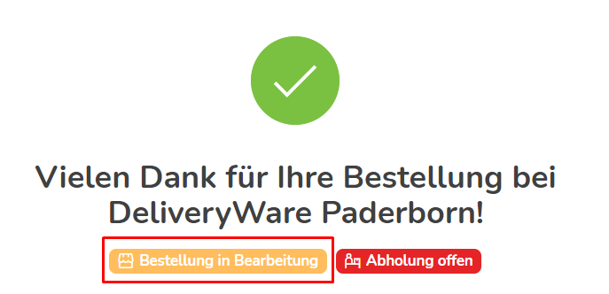

# Dashboard

Für diese Dokumentation verwenden wir zur Veranschaulichung Screenshots von den mitgelieferten Demo-Daten.

Das Dashboard von DeliveryWare ist im Backend unter Dashboard -> Shops zu finden.

## Übersicht vom Dashboard
 

Das Dashboard lässt sich in fünf Bereiche einteilen.

Damit der Kunde immer weiß, welchen Status seine Bestellung grade hat, wird er
bei jeder Statusänderung in der Bestellbestätigung und per E-Mail darüber informiert.

### **Offene Bestellungen:** 

Hier werden eingegangene Bestellungen aufgelistet.
Grundlegende Informationen wie Anschrift, Zahlungsart, Lieferung oder 
Selbstabholung, Telefonnummer und Entfernung zum Kunden werden sofort angezeigt.

Durch einen Klick auf die Bestellnummer wird die Detailansicht der Bestellung geöffnet.
Hier ist zu sehen, was die Bestellung vom Kunden beinhaltet.
Dabei wird auch die Karte auf das Lieferziel fokussiert.

Falls eine Bestellung nicht angenommen werden soll, kann diese durch Klick auf
"ABBRECHEN" auch abgelehnt werden.
Anderenfalls musst Du die Bestellung bestätigen, um den Vorgang fortzusetzen.

### **Bestellung in Bearbeitung:**

Hast Du die Bestellung bestätigt und einen Bon-Drucker eingerichtet erscheint nun eine
Meldung, ob ein Bon gedruckt werden soll.

Die Bestellung hat jetzt den Status "In Bearbeitung". Der Kunde wird in der Bestellbestätigung
darüber informiert und kann sehen, dass sich der Status geändert hat.

Um den Prozess weiter zu führen, muss nun auf "ABHOLUNG" oder "Lieferung" geklickt werden.
Die Schaltfläche erkennt anhand der vom Kunden getätigten Auswahl, welche Möglichkeit vorhanden ist.

Sollte der Kunde "Lieferung" ausgewählt haben, erscheint nun eine Meldung, in der ein Lieferdienst
ausgewählt werden muss.

### **Lieferung:**

Dies ist der letze Status einer Bestellung.

Durch einordnung in diese Kachel wird der Kunde informiert, dass die Bestellung
fertig verarbeitet wurde und sich in Zustellung befindet.

Sofern GPS-Tracking eingerichtet wurde, besteht für den Kunden auch die Möglichkeit 
die Lieferung / den Lieferanten live zu verfolgen.

Ist die Lieferung abgeschlossen und die Bestellung bezahlt, kann die Bestellung 
jetzt abgeschlossen werden.

### **Selbstabholung:**

Dies ist der letze Status einer Bestellung.

Durch einordnung in diese Kachel wird der Kunde informiert, dass die Bestellung
soweit verarbeitet wurde, dass sie zur Abholung bereit ist.

Jetzt kann die Bestellung abgeschlossen werden.

### **Karte:**

Die Karte dient als Hilfsmittel, damit unter Anderem eine Route für die Auslieferung geplant
werden kann. 

Der Fokus ist Standartmäßig immer im Zentrum aller Bestellungen.
Wird eine Bestellung fokussiert, fokussiert auch die Karte auf die dazu gehörige Anschrift.

