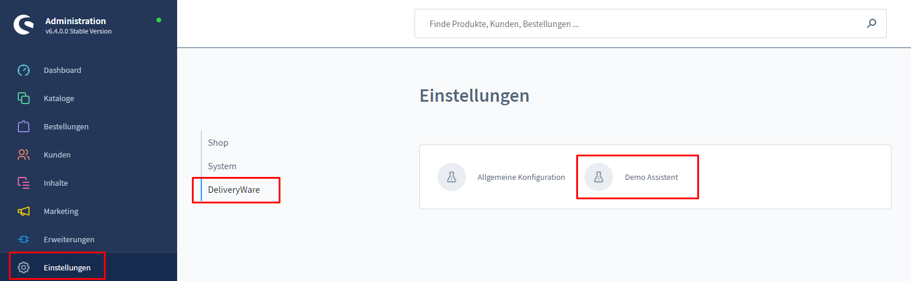
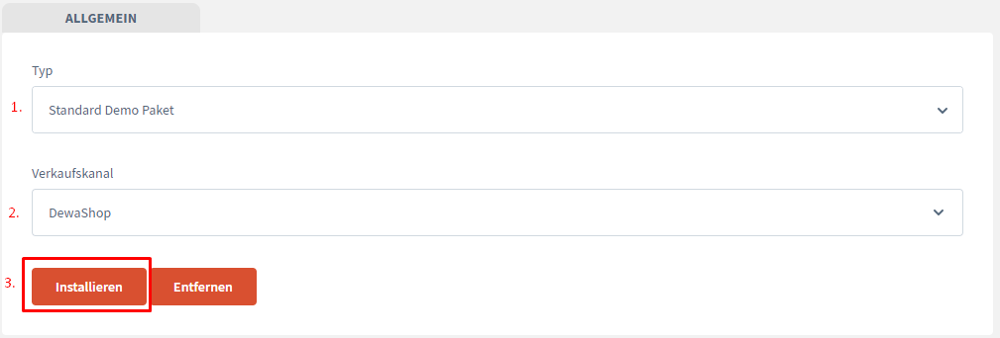

# Demo Assistent

DeliveryWare is provided by houses from a number of demographics with which you should be familiar with the configuration
Deiner Produkte helfen soll.

However, these must be installed as a matter of course.

## Install demo data

The Demo Wizard can be found in the backend under
Settings -> DeliveryWare -> Demo Assistant.

After opening the interface, a selection of packages is available under "Type".
In the future, additional demo packages will also be available for selection. These can simply be
installed as a plugin.

Under "Sales channel" the sales channels you have created are listed.
Here you have to select where the demo data should be installed.

Now simply press "Install" - the demo data will be installed automatically.

### NOTICE:
If other data are already installed, these must be removed before,
otherwise conflicts may occur in the database!

To do this, also select the sales channel and instead of "Install" select the "Remove" function.
function instead of "Install".