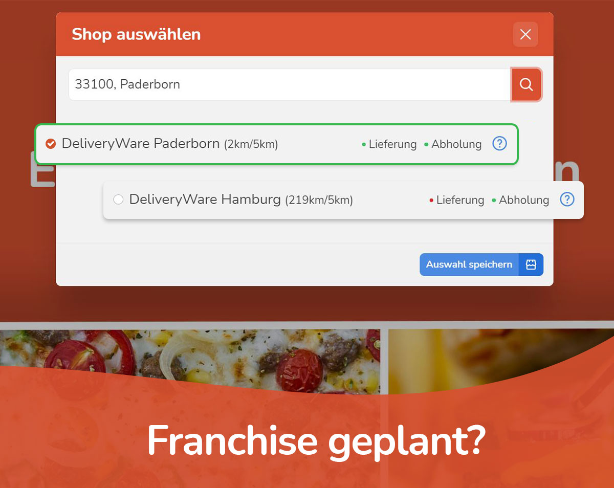

# Start

**Notice:** DeliveryWare is currently available 100% free for you at launch! The point is to collect a lot of feedback. So you also get 100% free support!

DeliveryWare is an all-in-one solution for your online delivery service. No matter what form of catering business, DeliveryWare offers you to start directly into the delivery service with only little setup effort! Extensive features support you for the optimal workflow in processing your orders.

Open the official product description of DeliveryWare to learn more details.

## Interface features at a glance

### Receipt printer API
➤Simple configuration of the printer in the network

➤ Additional receipt printers can be integrated without any problems

➤This service is 100% free of charge for DeliveryWare customers.

### Live GPS-Tracking App
An important information for you and your customers is the location of the current order. We have created a GPS tracking app for your delivery staff to track the live location of the order.

As a store owner, you can easily download the app from your store dashboard and make it available to your delivery staff.

➤ Live tracking of orders with pinpoint accuracy

➤ Your customers know exactly when their deliveries arrive.

➤ You as the store operator have permanent control

➤ Child's play linking of the app with your store via store url

➤ The app is 100% free of charge for DeliveryWare customers

### Restaurant - search portal (WIP)
The search portal is an independent search engine for all stores that use DeliveryWare. As a store owner, you benefit from more reach, as the portal lists all stores that match the customer's search radius.

Inclusion in the restaurant search portal is optional. So you don't have to list your store if you don't want to. But who has anything against more reach?

➤ The information for the merchant portal is automatically detected

➤ You benefit passively from our marketing campaigns

➤ The dealer portal is permanently improved and you profit

➤ You have no effort and profit fully automatically

➤ 100% free of charge for DeliveryWare customers

## Interesting for freelancers and agencies

**For the "restaurant around the corner "**.

Create a complete delivery service for your favorite restaurant. You are happy!

**Implementation of franchising planned?**

With DeliveryWare it is possible to manage multiple stores and locations. Talk to us and we will help you.

**May it be a little more?**

DeliveryWare is based on Shopware 6 and is therefore, as you surely know, limitlessly expandable.

**Talk to us openly**

We are happy about cooperations! Use DeliveryWare and we will return the favor.

**Commission and remuneration models**

You want to implement several stores with DeliveryWare? Then you will of course profit with.

**Work effectively with us**

We would like to integrate DeliveryWare into the catering business and are looking forward to many cooperations at many locations.

## Video & Pictures

    <iframe 
        width="560" 
        height="315" 
        src="https://www.youtube.com/embed/PXDDza2qoAw" 
        title="YouTube video player" frameborder="0" 
        allow="accelerometer; autoplay; clipboard-write; encrypted-media; gyroscope; picture-in-picture" allowfullscreen>
    </iframe>

