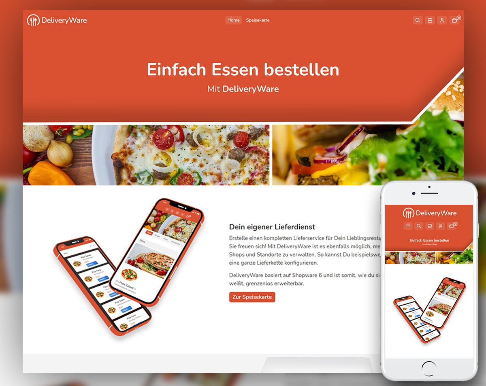
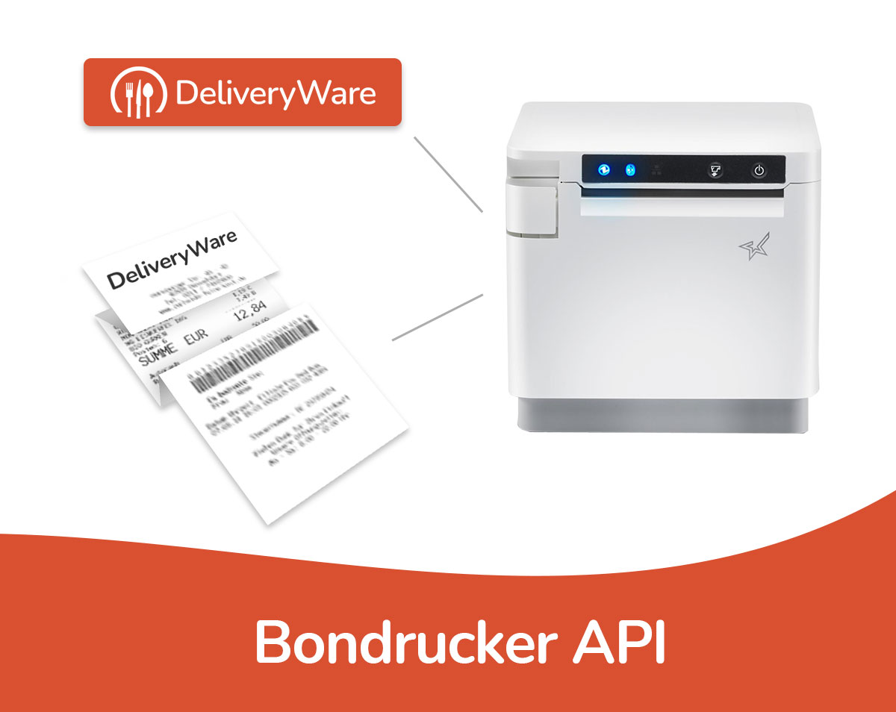
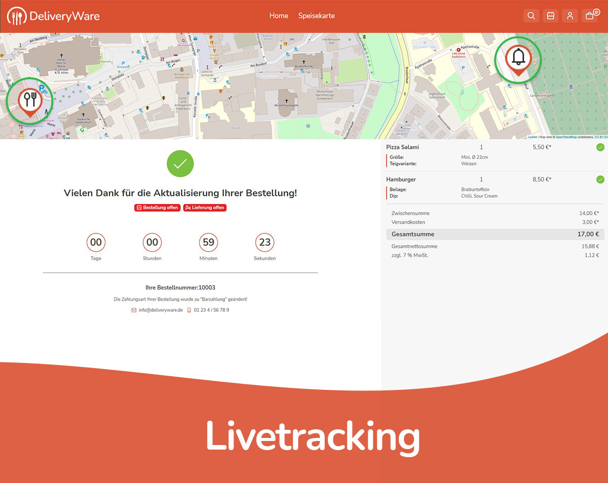

# Start

**Hinweis:** DeliveryWare ist aktuell zur Markteinführung 100% kostenlos für dich verfügbar! Es geht darum, sehr viel Feedback einzusammeln. Du erhältst also auch 100% kostenlosen Support!

DeliveryWare ist eine All-In-One Lösung für Deinen Online-Lieferdienst. Egal welche Form des Gastronomiebetriebs, DeliveryWare bietet Dir mit nur wenig Einrichtungsaufwand, direkt in den Lieferdienst zu starten! Umfangreiche Funktionen unterstützen Dich für den optimalen Workflow bei der Abwicklung Deiner Bestellungen.

Öffne die [offizielle Produktbeschreibung](https://store.shopware.com/appfl57695012045f/deliveryware-all-in-one-software-fuer-lieferdienste.html) von DeliveryWare, um mehr Details zu erfahren.

##Live Demo

Du möchtest DeliveryWare in Action sehen? Kein Problem!
Schaue Dir  unsere  [LIVE-Demo](https://dewashop.de/) an.

**Zugangsdaten für das Backend:**
- **Benutzer:** ``` demo ```
- **Passwort:** ``` shopware ```

## Schnittstellenfeatures im Überblick

###Bondrucker API
➤ Einfache Konfiguration des Druckers im Netzwerk

➤ Weitere Bondrucker können problemlos integriert werden

➤ Dieser Service ist zu 100% kostenlos für Kunden von DeliveryWare


###Live GPS-Tracking App
Eine wichtige Information für Dich und Deine Kunden ist der Standort der aktuellen Bestellung. Wir haben eine GPS-Tracking App für Deine Auslieferer erstellt, um den Live-Standort der Bestellung zu tracken.

Die App kannst Du als Shopbetreiber ganz einfach in deinem Shop-Dashboard herunterladen und für deine Auslieferer bereitstellen.

➤ Punktgenaues Livetracking der Bestellungen

➤ Deine Kunden wissen genau, wann ihre Lieferungen eintriffen

➤ Du als Shopbetreiber hast die permanente Kontrolle

➤ Kinderleichte Verknüpfung der App mit deinem Shop per Shop-Url

➤ Die App ist zu 100% kostenlos für Kunden von DeliveryWare


###Restaurant - Suchportal (folgt)
Das Suchportal ist eine eigenständige Suchmaschine für alle Shops, die DeliveryWare nutzen. Als Shopbetreiber profitierst Du durch mehr Reichweite, da das Portal alle Shops listet, die mit dem Suchradius des Kunden übereinstimmen.

Die Aufnahme in das Restaurant - Suchportal ist optional. Du musst Deinen Shop also nicht listen lassen, wenn du nicht möchtest. Aber wer hat schon etwas gegen mehr Reichweite?

➤ Die Informationen für das Händlerportal werden automatisch erkannt

➤ Du profitierst passiv von unseren Marketingkampagnen

➤ Das Händlerportal wird permanent verbessert und Du profitierst

➤ Du hast keinen Aufwand und profitierst vollautomatisch

➤ 100% kostenlos für Kunden von DeliveryWare

##Interessant für Freelancer und Agenturen

**Für das "Restaurant um die Ecke"**

Erstelle einen kompletten Lieferservice für Dein Lieblingsrestaurant. Sie freuen sich!

**Umsetzung von Franchising geplant?**

Mit DeliveryWare ist es möglich, mehrere Shops und Standorte zu verwalten. Sprich mit uns und wir helfen Dir.

**Darf es etwas mehr sein?**

DeliveryWare basiert auf Shopware 6 und ist somit, wie du sicherlich weißt, grenzenlos erweiterbar.

**Sprich mit uns ganz offen**

Wir freuen uns über Kooperationen! Nutze DeliveryWare und wir revanchieren uns.

**Provisions- und Vergütungsmodelle**

Du möchtest gleich mehrere Shops mit DeliveryWare umsetzen? Dann profitierst du selbstverständlich mit.

**Arbeite effektiv mit uns zusammen**

Wir möchten DeliveryWare in den Gastronomiebetrieb integrieren und freuen uns über viele Kooperationen an vielen Standorten.


## Video & Bilder
<div>
    <iframe 
        width="560" 
        height="315" 
        src="https://www.youtube.com/embed/PXDDza2qoAw" 
        title="YouTube video player" frameborder="0" 
        allow="accelerometer; autoplay; clipboard-write; encrypted-media; gyroscope; picture-in-picture" allowfullscreen>
    </iframe>
</div>







