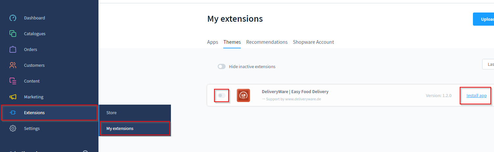
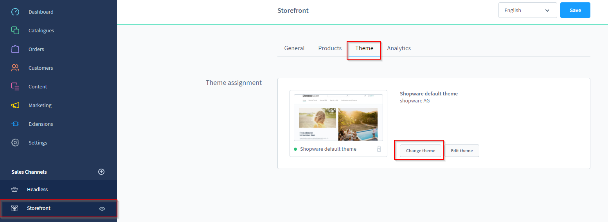
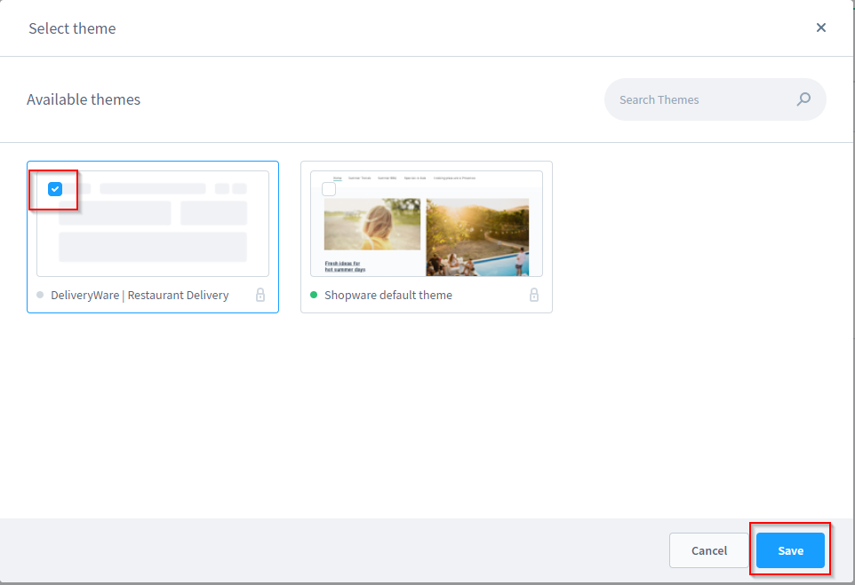

# Installation

For this documentation we use screenshots from the provided demo data for illustration.

## Requirements
A running instance of Shopware 6.4 and our free [Foundation Plugin](../../foundation/index.md) is required to install and use DeliveryWare.

To avoid complications and errors during setup, we recommend that any third-party plugins are uninstalled.

## Install Theme

After purchasing DeliveryWare you have to log in to the admin area of your shop.
of your store.
Navigate to "Extensions => My extensions".

DeliveryWare should now be listed under the "Themes" tab.

Install the app by clicking on "Install App" and activate it afterwards.

## Assign theme

Once the theme is activated, it needs to be assigned to your sales channel.

To do this, click on your sales channel in the navigation and change to the "Theme" tab.

Then click on "Change Theme", choose the DeliveryWare Theme and
save your changes.
Confirm the message that appears again.

## Images

