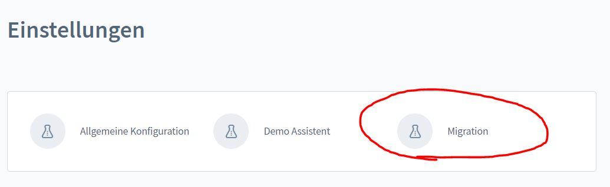
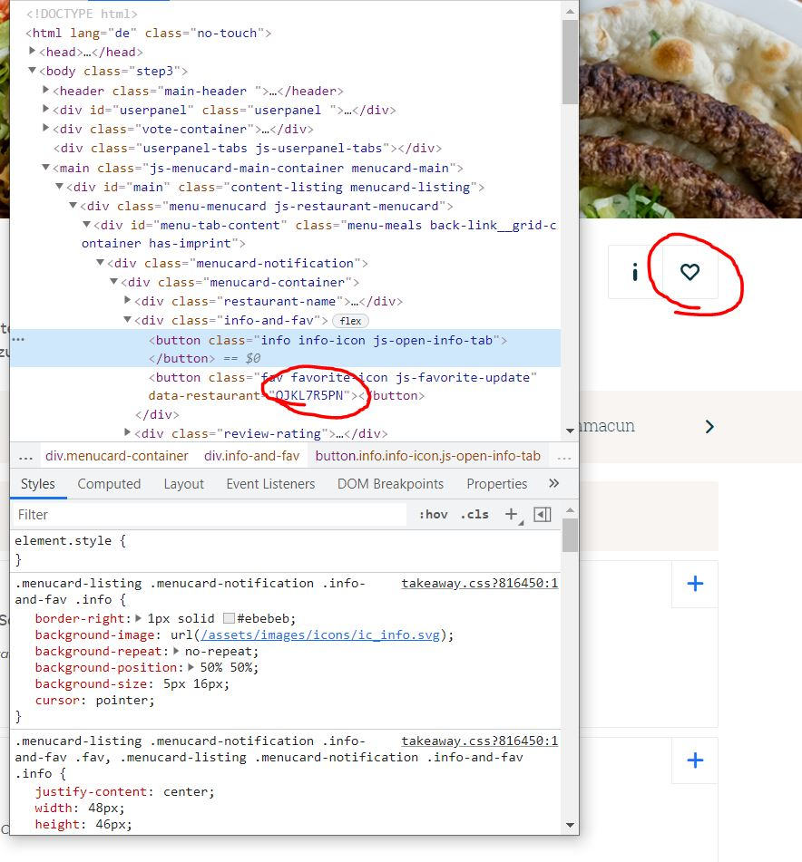
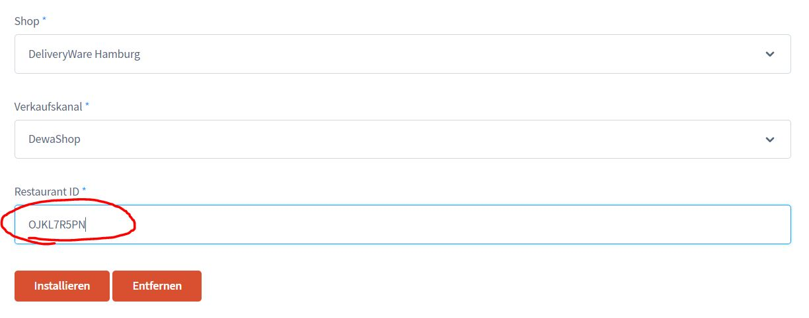

# Migration Tool

**This tool is not part of the DeliveryWare base plugin and must be purchased separately!**

If you are already a customer of a platform, but would like to switch, then you can simply
you can easily import most of your data into DeliveryWare.

Please note that you are not allowed to use this tool to import the stores of your competitors!

Otherwise your data is yours and of course you can use our Add-On to import it to your
Your DeliveryWare store.

## Step 1

Create a store with the identical address of your store on the platform.

## Step 2

Go to the settings, click on the "DeliveryWare" tab and select "Migration".

## Step 3

Go to the menu of a platform and right-click on the heart.
In the context menu select "Examine".

Now a source code opens - there you can copy the ID of your restaurant.

## Step 4

Add the restaurant ID in the form - choose your store from step 1 and your sales channel.

Now click on "Install", after a few minutes your data is completely imported!

**Important note: Ingredients, ingredients and side dishes are not imported - these must be maintained manually after the import!

