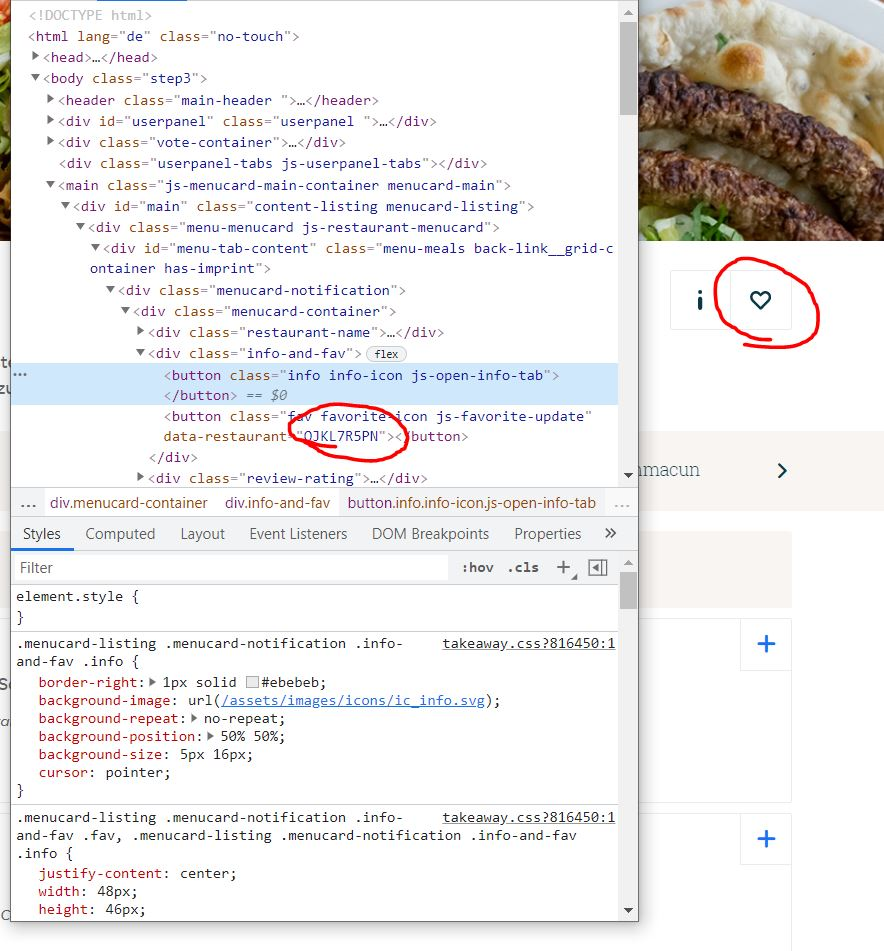
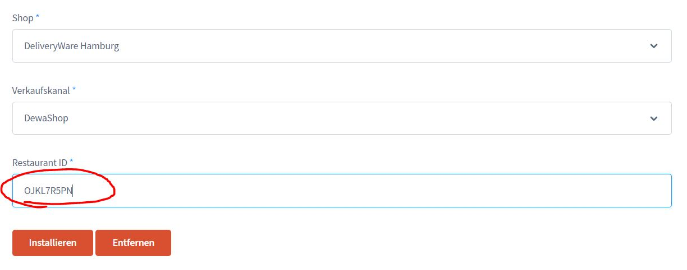

# DeliveryWare Migration

**Dieses Tool ist nicht Bestandteil des DeliveryWare Basis Plugins und muss extra erworben werden!**

Falls Du bereits Kunde bei einer Plattform bist, aber gerne wechseln möchtest, dann kannst
du einen Großteil deiner Daten einfach in DeliveryWare Importieren.

Bitte beachte, dass du dieses Tool nicht nutzen darfst um die Shops Deiner Mitbewerber zu importieren!

Ansonsten gehören Deine Daten Dir und diese kannst Du selbstverständlich mit unserem Add-On auf
Dein DeliveryWare Shop übernehmen.

## Schritt 1

Erstelle einen Shop mit der Identischen Adresse deines Shops auf der Plattform.

## Schritt 2

Gehe in die Einstellungen, klicke dort auf den Reiter "DeliveryWare" und wähle "Migration"

## Schritt 3

Gehe auf die Speisekarte von einer Plattform und klicke mit der Rechten Maustaste auf das Herz.
Im Kontextmenü wählst du "Untersuchen".

Nun öffnet sich ein Quelltext - dort kannst Du die ID Deines Restaurant kopieren.

## Schritt 4

Füge die Restaurant ID in das Formular ein - wähle Deinen Shop aus Schritt 1 und Deinen Verkaufskanal.

Klicke nun auf "Installieren", nach wenigen Minuten sind Deine Daten vollständig übernommen!

**Wichtiger Hinweis:** Zutaten, Inhaltsstoffe und Beilagen werden nicht importiert - diese müssen nach dem Import manuell gepflegt werden!

