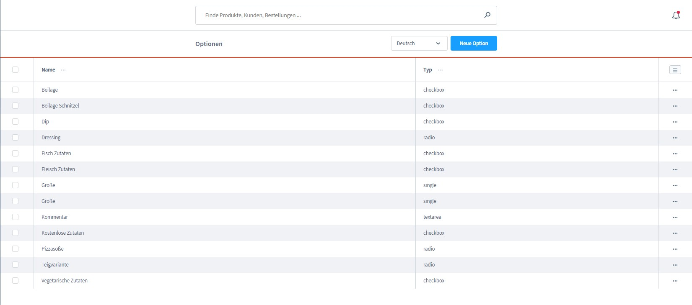
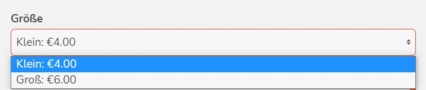
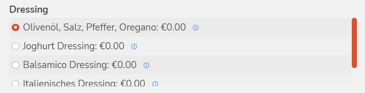
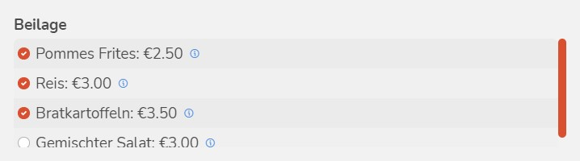
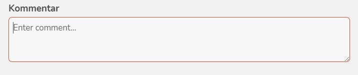

# Configurator (options)

With DeliveryWare it is possible to add additional options to the individual categories.
For example, for a salad there are always certain dressings to choose from or the customer should have the option to choose the size of a pizza.

For this documentation, we use screenshots from the demo data provided for illustration purposes.

## Create ptions

In the administrator area under "DeliveryWare ==> Options" there is the
Possibility to create own options.

- **Name:** In this input field the name of the operator must be deposited.
  This name will also be displayed in the frontend.

- **Type:** There are several types to choose from:

----
1. **Simple selection:** In the form of a dropdown. Select this field for later price calculations (price factor).

----
2. **Radio button selection:** This option is a list selection with absolute prices.

----
3. **Checkbox selection:** This is a multiple selection.

----
4. **Text field:**

----

- **Unit:** (Only relevant for single selection)
- **Reference unit:** (Only relevant for single selection)
