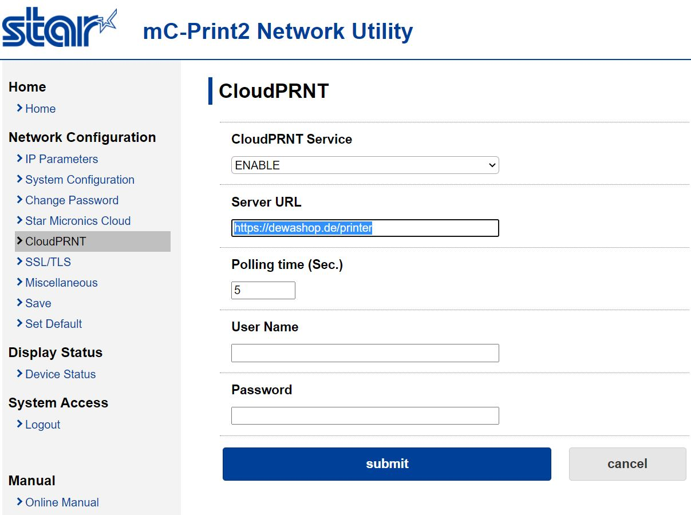
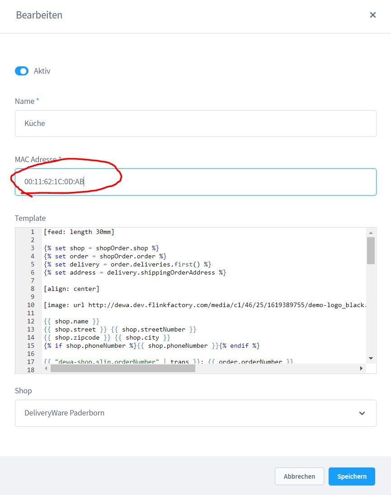
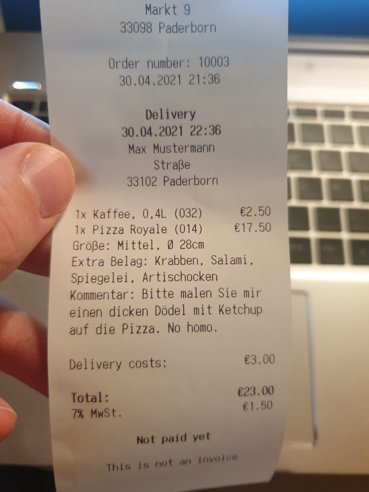

# Printer setup

## Star mC-Print2

1. connect your printer to the network
2. print a self test by pressing the `POWER ON` and the `FEED` button
3. on the printout you will find an IP address for your local network
5. log in and go to the `CloudPRNT` tab
   Printer setup

6. enter the URL of your store + `/printer` - e.g. `https://dewashop.de/printer`.
7. go to the tab `Home` and copy the MAC address of your printer

8. now log in to the admin area of your store.
9. open the store settings and scroll to the bottom of the page
10. create a printer and copy the MAC address

6. enter the URL of your store + `/printer` - e.g. `https://dewashop.de/printer`.

All right, the setup has been completed.

Now make a test order, go to the store dashboard and when accepting it, select the
select the freshly set up receipt printer.

If by chance you have not forgotten to put a paper roll into the printer,
you should now have this (or a similar) result!

By the way, there's also an official video for the printer. It is for our competitor
competitor `WooCommerce` but a look into it might be helpful for you!

<iframe width="560" height="315" src="https://www.youtube.com/embed/2O3pZJ-kfqk" title="YouTube video player" frameborder="0" allow="accelerometer; autoplay; clipboard-write; encrypted-media; gyroscope; picture-in-picture" allowfullscreen></iframe>

In the app settings, you can also trigger the creation of receipts for each
order - this is worthwhile e.g. if you receive orders in the evening for the
next day (baker, butcher, etc.)

`/admin#/sw/extension/config/DewaShop`

