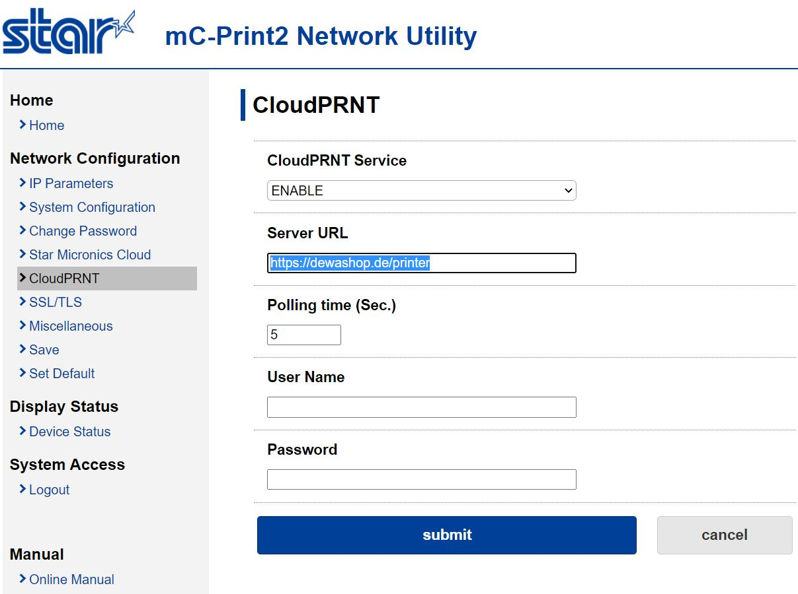
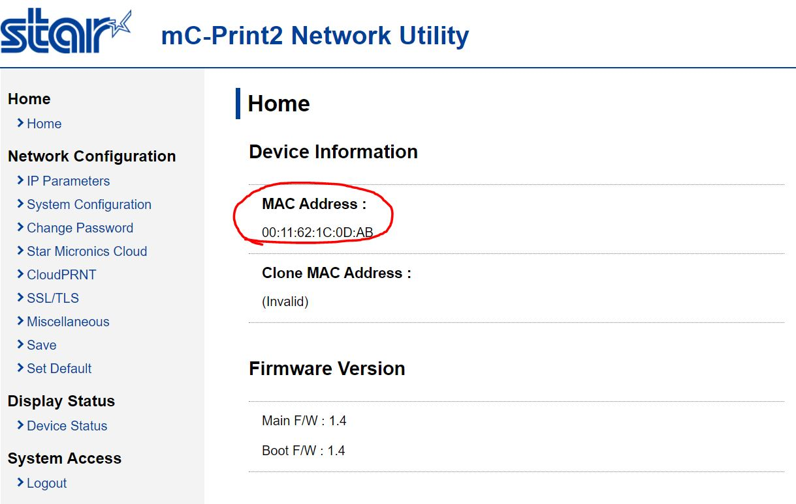
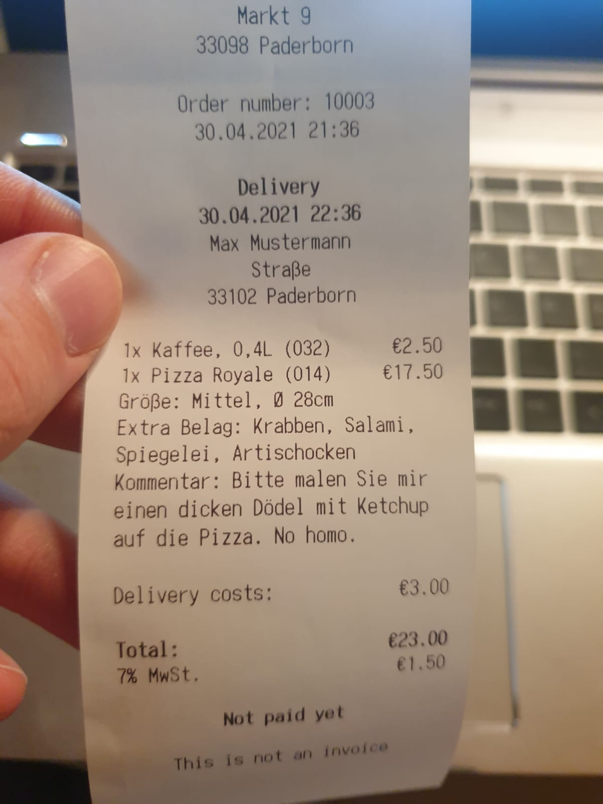
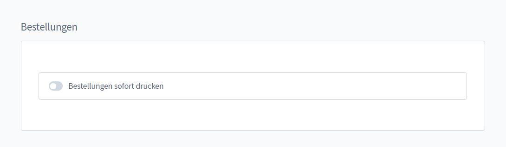

# Bon Drucker Einrichtung

## Star mC-Print2

1. Schließe Deinen Drucker am Netzwerk an
2. Drucke einen Selbsttest indem Du den `POWER ON` und den `FEED` Button gedrückt hälst
3. Auf dem Ausdruck befindet sich eine IP Adresse für Dein lokales Netzwerk
5. Log Dich ein und gehe zum Reiter `CloudPRNT`

6. Gib dort die URL Deines Shop + `/printer` ein - z.B. `https://dewashop.de/printer`
7. Wechsle nun zum Reiter `Home` und kopiere die MAC Adresse des Druckers

8. Logge dich nun in den Admin-Bereich Deines Shops ein
9. Rufe die Shop-Einstellungen auf und scrolle bis zum Ende der Seite
10. Lege einen Drucker an und kopiere die MAC Adresse

Alles klar, die Einrichtung wurde abgeschlossen.

Mache nun eine Testbestellung, gehe zum Shop-Dashboard und wähle beim Akzeptieren
den frisch eingerichteten Bon-Drucker aus.

Falls Du zufällig nicht vergessen hast eine Papier-Rolle in den Drucker zu legen,
solltest Du nun dieses (oder ein ähnliches) Ergebnis haben!

Ach ja, es gibt auch ein offizielles Video zu dem Drucker. Es ist zwar für unseren
Mitbewerber `WooCommerce` aber ein Blick darein könnte hilfreich für Dich sein!

<iframe width="560" height="315" src="https://www.youtube.com/embed/2O3pZJ-kfqk" title="YouTube video player" frameborder="0" allow="accelerometer; autoplay; clipboard-write; encrypted-media; gyroscope; picture-in-picture" allowfullscreen></iframe>

Du kannst in den App-Einstellungen auch die Belegerstellung bei jeder 
Bestellung auslösen - das lohnt sich z.B. wenn man Abends Bestellungen für den
Folgetag empfängt (Bäcker, Fleischer usw)

`/admin#/sw/extension/config/DewaShop`

