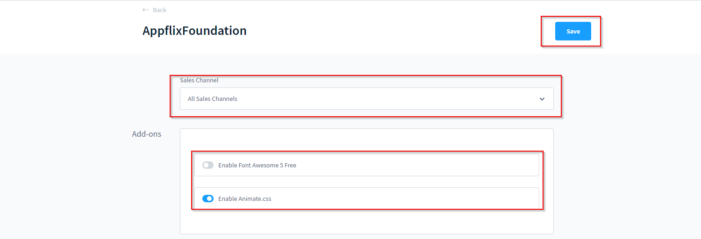

# Add-ons

## FontAwesome 5 Free
AppflixFoundation hat das bekannte und beliebte **FontAwesome 5 free** bereits integriert, sodass du das beliebte Tool für Schriftarten und Symbolen sofort nutzen kannst.

## Animate.css

Auch **Animate.css** ist vorhanden, sodass Du coole und Aufmerksamkeitserregende Slider und Animationen in deinem Shop nutzen kannst.

## Wie nutze ich die Funktionen?

1. Wähle den Verkaufskanal aus, auf dem Du die Funktionalitäten nutzen möchtest

2. Aktiviere einfach das, was Du brauchst,  unter "Extensions => My extensions => AppflixFoundation - Base Plugin => Configuration => Add-ons"

3. Drücke speichern  und individualisiere wie Du es möchtest!

## Bilder

