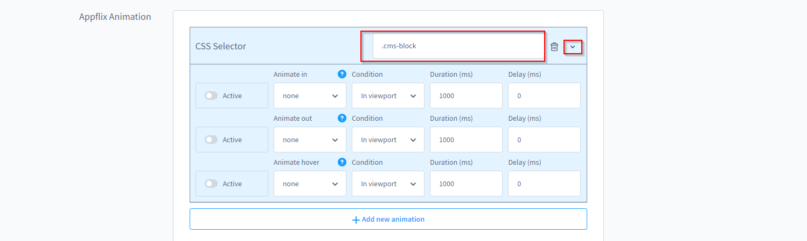

# Animations

Animate.css creates a cool way for you to implement animations in your store yourself without any programming knowledge.

## Supported animations:
- Attantion Seekers
- Bouncing Entrances
- Bouncing Exits
- Fading Entrances
- Fading Exits
- Flippers
- Lightspeed
- Rotating Entrances
- Rotating Exits
- Sliding Entrances
- Sliding Exits
- Zoom Entrances
- Zoom Exits
- Specials

## Set up animations

1. navigate to "Extensions => My extensions => AppflixFoundation - Base Plugin => Configuration => Appflix Animation".
2. click Add new animation
3. specify the **CSS selector*** you want the rule to apply to and expand the menu under **>**.
4. activate the animation and configure the rules under which they should be active
    1. animations on fade in and fade out or be configured differently. For example, an object can be faded in from the left and faded out in sequence on the right.
5. save

*You can easily find out a CSS selector by right clicking in the browser and "explore". The last image shows an example.

## Images

