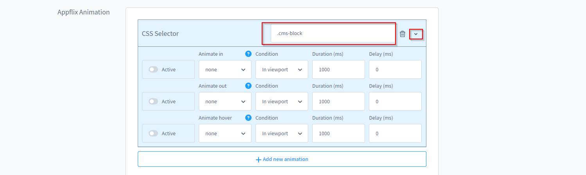
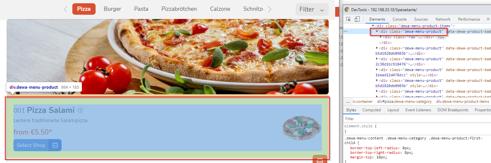

# Animationen

Durch Animate.css wird eine coole Möglichkeit geschaffen, mit der Du ohne Programmierwissen Animationen in Deinem Shop selbst umsetzen kannst.

## Unterstützte Animationen:
- Attantion Seekers
- Bouncing Entrances
- Bouncing Exits
- Fading Entrances
- Fading Exits
- Flippsers
- Lightspeed
- Rotating Entrances
- Rotating Exits
- Sliding Entrances
- Sliding Exits
- Zoom Entrances
- Zoom Exits
- Specials

## Einrichtung von Animationen

1. Navigiere zu "Extensions => My extensions => AppflixFoundation - Base Plugin => Configuration => Appflix Animation"
2. Klicke Add new animation
3. Gebe den **CSS-Selektor*** an, für den die Regel gelten soll und erweitere das Menü unter **>**
4. Aktiviere die Animation und konfiguriere die Regeln unter denen sie aktiv sein sollen
   1. Animationen beim Einblenden und beim Ausblenden oder unterschiedlich konfiguriert werden. Zum Beispiel kann ein Objekt von Links eingeblendet werden und in Folge rechts ausgeblendet werden.
5. Speichern

*Einen CSS-Selektor kann man einfach durch Rechtsklick im Browser und "untersuchen" herausfinden. Das letzte Bild zeigt ein Beispiel.

## Bilder

