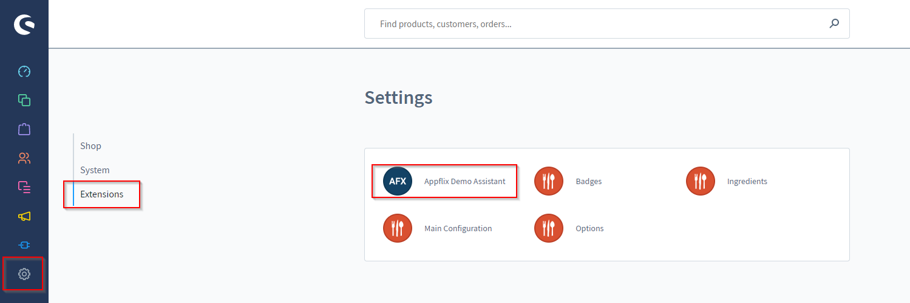
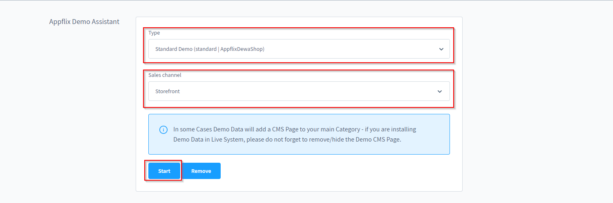

# Demodaten installieren

## Beschreibung

AppflixFoundations bringt die Möglichkeit mit deinen Shop schnell mit Demodaten zu füllen, sodass Du mit diesesen direkt loslegen kannst!

Was genau installiert wird hängt davon ab, welches unserer Themes Du benutzt, da die jeweiligen Daten dort hinerlegt sind. Mit diesesm Plugin wird nur die Möglichkeit geschaffen diese schnell und unkompliziert zu installieren.

## Installationsanleitung

Nur 4 Schritte sind notwendig, um unsere Demodaten in Deinem Shop zu integrieren!

1. Nagiviere unter "Settings => Extensions => Appflix Demo Assistant" zu unserem Tool
2. Wähle das Demopaket aus, welches Du installieren möchstest
3. Wähle den Verkaufskanal aus, auf dem Du das Paket insatllieren möchtest
4. Starte die Installation*

*Wurden bereits Demodaten installiert, müssen diese vorher mit "remove" entfernt werden!

## Bilder

