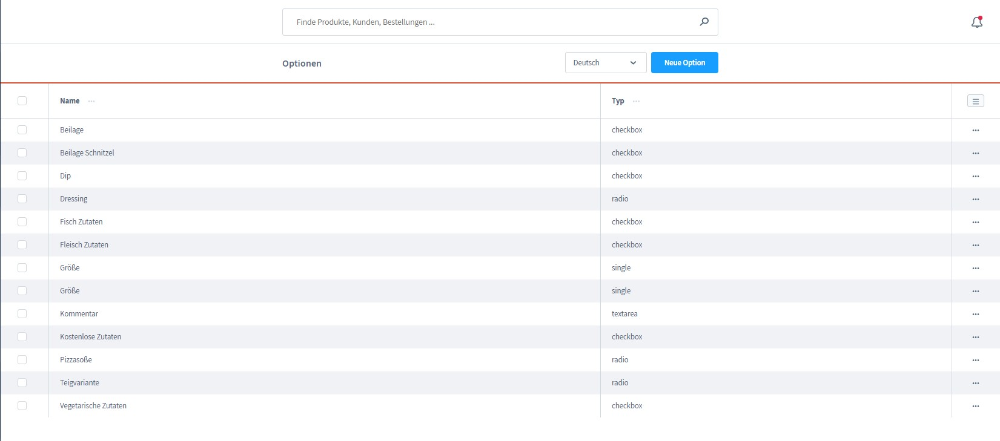
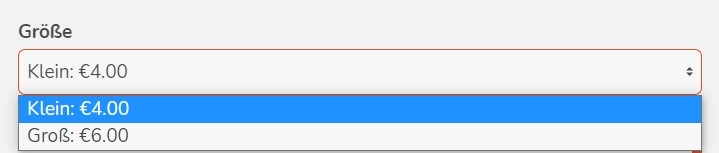
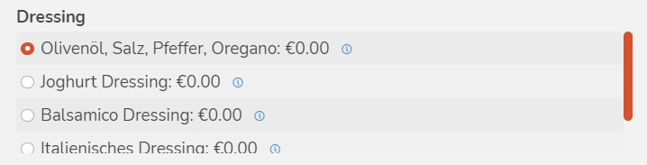
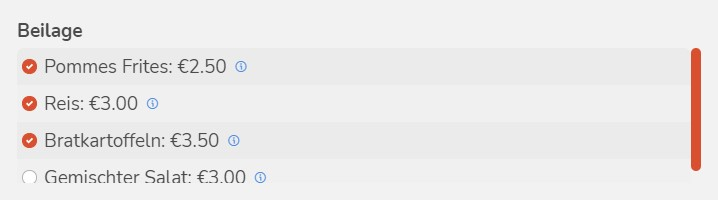
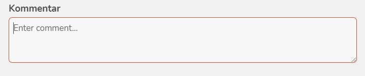

# Optionen

Mit DeliveryWare besteht die Möglichkeit den einzelnen Kategorien zusätzliche Optionen hinzuzufügen.
Zum Beispiel stehen bei einem Salat immer bestimmte Dressings zur Auswahl oder der Kunde soll die  Möglichkeit haben bei einer Pizza die Größe auszuwählen.

Für diese Dokumentation verwenden wir zur Veranschaulichung Screenshots von den mitgelieferten Demo-Daten.

## Optionen erstellen

Im Administratorbereich unter "DeliveryWare ==> Optionen" besteht die 
Möglichkeit eigene Optionen anzulegen.

- **Name:** In diesem Eingabefeld muss der Name des Betreibers hinterlegt werden. 
  Dieser wird ebenfalls im Frontend ausgegeben.

- **Typ:** Es stehen mehrere Typen zur Auswahl:

----
1. **Einfachauswahl:** In Form eines Dropdown's. Wähle dieses Feld für spätere Preiskalkulationen (Preisfaktor).
  
  

----
2. **Radio-Button-Auswahl:** Diese Option ist eine Listenauswahl mit absoluten Preisen.

----
3. **Checkbox Auswahl:** Hierbei handelt es sich um eine Mehrfachauswahl.

  

----
4. **Textfeld:** 
  
  

----

- **Einheit:**  (Nur für Einfachauswahl relevant)
- **Referenzeinheit:** (Nur für Einfachauswahl relevant)
